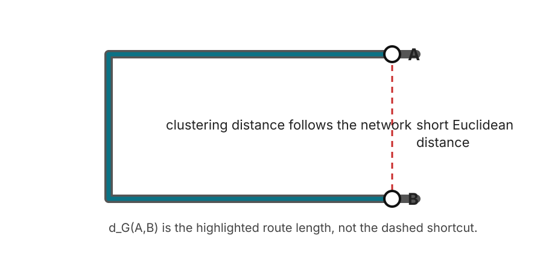
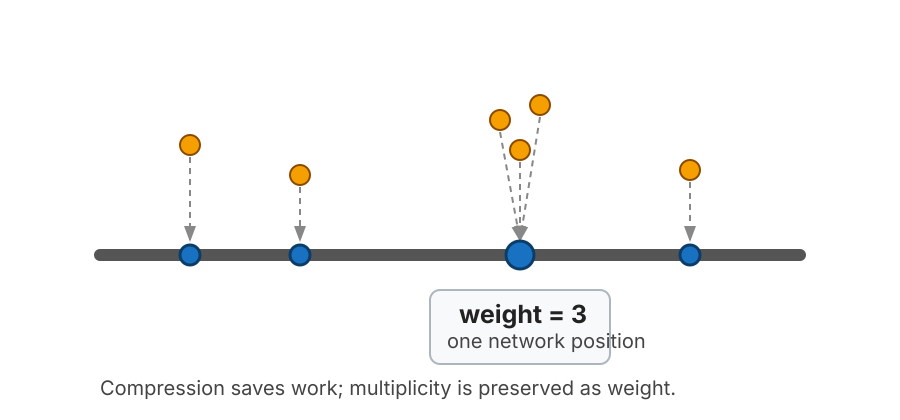
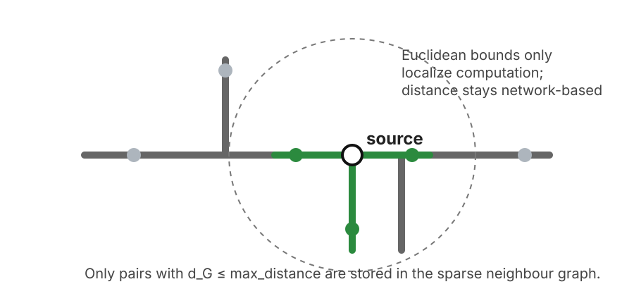
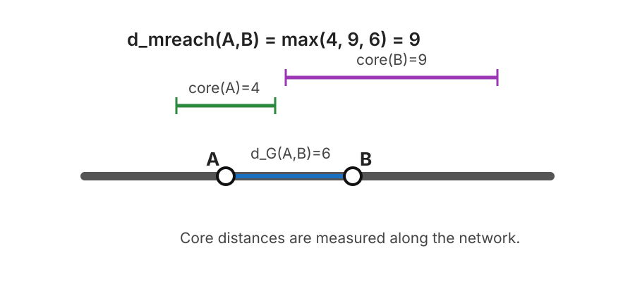
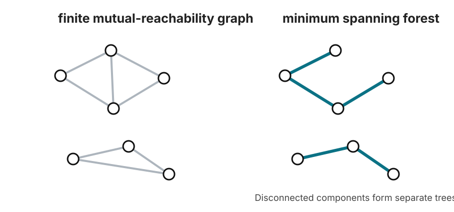
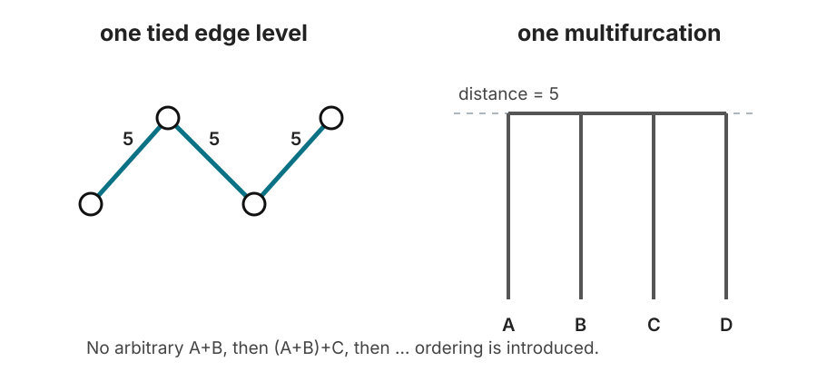

# How `net-hdbscan` works

`net-hdbscan` runs **HDBSCAN\*** on geospatial observations using **shortest-path distance along a supplied line network** instead of straight-line distance.

The HDBSCAN part is recognizable: estimate local density with core distances, transform distances by mutual reachability, build a minimum spanning structure, form a hierarchy, condense that hierarchy, and select persistent clusters. The important difference is what happens **before** and **around** those steps: observations must be snapped to a network, coincident snapped positions can carry multiplicity, pairwise distances are discovered by bounded shortest-path search, and the resulting sparse distance graph may be truncated or disconnected.

This page follows the same “see the algorithm one stage at a time” spirit as the HDBSCAN documentation's *How HDBSCAN Works*, but the explanation and figures here are specific to `net-hdbscan`.

## The whole pipeline


At a high level, the clustering stage can be read as nine steps:

1. Define distance on the supplied network.
2. Snap observations to continuous positions on that network.
3. Collapse observations at exactly the same network position into weighted positions.
4. Discover network-neighbour pairs only up to `max_distance`.
5. Compute core distance and mutual-reachability distance.
6. Build a minimum spanning **forest** of the mutual-reachability graph.
7. Build the single-linkage hierarchy, processing equal-distance merges simultaneously.
8. Condense the hierarchy using `min_cluster_size`.
9. Select clusters and compute membership strengths, then map them back to the original observations.

> **Two graphs are involved. Do not confuse them.**
>
> The **line network** is the transport/road/river/etc. graph used to measure shortest-path distance. HDBSCAN then forms a different graph whose vertices are **snapped observation positions** and whose edge weights are **mutual-reachability distances**. The minimum spanning forest is built from this second graph, not from the road network.

---

## 1. Distance means shortest path on the network

Suppose observation \(i\) snaps to network position \(s_i\) and observation \(j\) snaps to \(s_j\). `net-hdbscan` uses

\[
d_G(i,j)
=
\min_{\pi:s_i\rightsquigarrow s_j}
\sum_{e\in\pi}\ell(e),
\]

where \(\pi\) is a path through the supplied line network and \(\ell(e)\) is the length of a network arc. If the two positions lie on disconnected components, \(d_G(i,j)=\infty\).



The dashed line in the figure is the tempting Euclidean shortcut. It is **not** the clustering distance. The actual route follows the network.

This has several consequences:

- The network CRS must be projected, and distance parameters use that CRS's linear units.
- Point-to-network snap distance is **not added** to \(d_G\). It is kept separately as a quality-assurance diagnostic.
- A geometric crossing is not automatically a junction. Lines connect only when they share a vertex after coordinate canonicalization.
- An optional polygon boundary filters which observations are eligible; it does not clip the network, so shortest paths may leave the polygon and re-enter it.

The network is built from straight arcs between consecutive line vertices. By default coordinates are canonicalized to 11 significant digits before shared vertices are identified.

---

## 2. Snap observations, then compress identical network positions

Raw observations do not have to fall exactly on a line. Each one is snapped to the nearest point of the nearest network arc.



After snapping, observations that occupy the **same network position** are represented once during the distance search. Their multiplicity becomes a weight.

If position \(p\) represents \(w_p\) observations, then by default it behaves like \(w_p\) identical observations in HDBSCAN. This avoids repeatedly solving the same shortest-path problem for co-located points.

There is one subtle topological rule here:

- A snapped **vertex** is identified by the network vertex ID, so the same junction reached through different incident arcs is one position.
- An **interior** snapped position is identified by its arc and offset along that arc. Two crossing arcs do not become connected merely because their coordinates happen to coincide.

With the default duplicate policy, multiplicity counts. A position with weight 8 contributes eight observations to `min_samples`, `min_cluster_size`, stability, and cluster size. The alternative `duplicates="once"` treats each distinct snapped position as weight 1.

---

## 3. Build only the network-distance graph that is needed

A complete pairwise distance matrix has \(O(n^2)\) pairs. For large spatial point sets that is usually unnecessary.

`net-hdbscan` therefore asks a narrower question:

> Which pairs of distinct snapped positions are at network distance at most `max_distance`, and what are those distances?

The public `neighbor_graph()` function returns a symmetric sparse matrix containing exactly those discovered pairs.



For a search horizon \(R=\texttt{max_distance}\),

\[
(i,j)\text{ is stored}
\quad\Longleftrightarrow\quad
d_G(i,j)\le R.
\]

Pairs outside the horizon, and pairs on disconnected network components, are absent from the sparse matrix.

The implementation uses bounded Dijkstra searches on local subgraphs and also handles pairs that lie on the same straight network arc directly. Spatial batching is only an implementation optimization: it changes memory use and runtime, not the resulting distances.

### `max_distance` is not DBSCAN `eps`

This distinction is essential.

`max_distance` is a **distance-discovery horizon**. It says how far the program is willing to measure pairwise network distances. It is not a density threshold and it does not directly determine cluster membership.

That means:

- The hierarchy is known exactly for relationships that can be established below the horizon.
- The program has no pairwise-distance information above the horizon.
- A core distance can be unresolved because the search horizon was too small.
- A core distance can also be unresolved for a structural reason: the entire connected component may contain too little effective weight.

The output diagnostics distinguish those cases.

---

## 4. Core distance estimates local density in network space

HDBSCAN needs a local density scale around each position. Let \(k=\texttt{min_samples}\), and let \(w_i\) be the multiplicity of snapped position \(i\).

The weighted core distance is the smallest network radius that contains at least \(k\) observations, counting the position's own weight:

\[
\operatorname{core}_k(i)
=
\inf
\left\{
r\ge 0:
w_i+
\sum_{\substack{j\ne i\\d_G(i,j)\le r}}
w_j
\ge k
\right\}.
\]

So:

- if \(w_i\ge k\), then \(\operatorname{core}_k(i)=0\);
- if enough neighbours are found within the stored sparse graph, the core distance is the distance to the neighbour that makes the cumulative weight reach \(k\);
- if the stored graph never reaches total weight \(k\), the core distance is \(\infty\).

This is HDBSCAN's familiar density idea, but density is being measured by **network travel distance**, not by a Euclidean ball.

`net-hdbscan` also has an optional `core_distance_floor`. If the floor is \(f>0\),

\[
\operatorname{core}'_k(i)
=
\max\{\operatorname{core}_k(i),f\}.
\]

The default is zero, which gives ordinary HDBSCAN\*. A positive floor is a package extension intended to prevent a very large stack of co-located observations from creating arbitrarily high local density.

---

## 5. Transform network distance into mutual-reachability distance

Raw single linkage can connect dense regions through a thin chain of sparse observations. HDBSCAN reduces that chaining effect by inflating distances involving locally sparse positions.

For two positions \(i\) and \(j\),

\[
d_{\mathrm{mreach},k}(i,j)
=
\max
\left\{
\operatorname{core}_k(i),
\operatorname{core}_k(j),
d_G(i,j)
\right\}.
\]



In the example:

\[
\operatorname{core}(A)=4,\qquad
\operatorname{core}(B)=9,\qquad
d_G(A,B)=6,
\]

so

\[
d_{\mathrm{mreach}}(A,B)=9.
\]

The network path between \(A\) and \(B\) is only 6 units long, but \(B\) lives at a sparser local scale, so the effective connection is pushed out to 9.

Pairs involving a position with infinite core distance do not enter the finite mutual-reachability graph.

---

## 6. Reduce the mutual-reachability graph to a minimum spanning forest

Imagine every snapped position as a vertex and every stored finite pair as an edge weighted by mutual-reachability distance.

If we gradually lower a distance threshold, edges disappear and connected components split. Those connected components define the single-linkage hierarchy. We do not need every edge to preserve that threshold-connectivity structure: a minimum spanning structure is enough.

Because the sparse network-distance graph can be disconnected, `net-hdbscan` constructs a **minimum spanning forest** rather than assuming one global tree.



The solid edges on the right are the minimum set needed to preserve when components become connected as the distance threshold rises.

Again, this is a forest over **observation positions**. It is not a minimum spanning tree of the road network.

Disconnected forest components are allowed. In the later hierarchy they are attached conceptually to a common root at

\[
\lambda = 0.
\]

This lets the package handle genuinely disconnected network components and distance graphs truncated by `max_distance`.

---

## 7. Build the hierarchy, with equal-distance merges happening simultaneously

Standard single linkage sorts spanning-tree edges by distance and merges components as edges appear.

There is a complication: network data often produces **exactly equal distances**. A binary implementation must choose some arbitrary order among tied edges. That can create zero-lifetime intermediate groups whose membership depends on row order or edge ordering.

`net-hdbscan` deliberately avoids that artifact.

At every distinct mutual-reachability distance, it processes **all edges at that distance together**. If several existing components become connected at one level, they form one multifurcation.



In the figure, three edges all appear at distance 5. The package does not pretend that one pair merged “before” the others. All four positions join at the same hierarchy level.

This tie rule is a deliberate hierarchy-level choice. On data without relevant ties, the implementation is designed to agree with standard HDBSCAN behavior. On tie-heavy data, the simultaneous rule can differ from an implementation that resolves ties by arbitrary binary ordering, while remaining invariant to observation order and point-ID naming under the package's deterministic conventions.

---

## 8. Condense the hierarchy using `min_cluster_size`

The raw single-linkage hierarchy contains many tiny branches. HDBSCAN condenses it by asking whether a split produces children large enough to count as clusters.

Let \(m=\texttt{min_cluster_size}\). At a split:

- if two or more children have size at least \(m\), that is a genuine cluster split;
- if exactly one child has size at least \(m\), that child continues the identity of the parent while the smaller children “fall out”;
- if no child reaches \(m\), all children fall out.

Sizes are weighted, so a snapped position with multiplicity \(w\) contributes \(w\), not 1.

HDBSCAN expresses hierarchy scale as

\[
\lambda = \frac{1}{d}.
\]

Large \(\lambda\) means a small distance scale and therefore a denser connection. Distance zero corresponds to \(\lambda=\infty\).

The condensed tree records, among other things, when a cluster is born, when positions leave it, its weighted size, and its parent-child relationships.

---

## 9. Select clusters by persistence and compute membership strength

The default selection method is Excess of Mass (`cluster_selection_method="eom"`).

For intuition, a cluster is valuable when many observations remain inside it over a long interval of \(\lambda\). In the expanded-observation view its stability is

\[
S(C)
=
\sum_{p\in C}
\left(
\lambda_p-\lambda_{\mathrm{birth}}(C)
\right),
\]

where \(\lambda_p\) is the level at which observation \(p\) leaves cluster \(C\).

With compressed positions this is equivalent to weighting each position's contribution by its multiplicity.

EOM walks upward through the condensed tree and compares the stability of a parent cluster with the summed stability of its selected descendants. A parent is kept when its own persistence is at least as good as replacing it with those descendants, subject to the configured size rules.

The alternative `cluster_selection_method="leaf"` selects leaf clusters of the condensed hierarchy. `cluster_selection_epsilon`, `max_cluster_size`, and `allow_single_cluster` then modify selection using the same broad semantics documented in the package API.

Once clusters are selected:

- selected positions receive cluster labels;
- positions not owned by a selected cluster are noise (`-1` in the lower-level API);
- membership strength is derived from how long the position survives relative to the selected cluster's lifetime.

The lower-level `HDBSCANResult.probabilities` values range from 0 to 1. The high-level pipeline writes these as `membership`.

---

## 10. Expand position-level results back to observations

The expensive work happens on distinct snapped positions. After clustering, the result is expanded back to every original observation.

If observations \(a,b,c\) all snapped to the same distinct position \(p\), then they share the position-level:

- HDBSCAN label,
- membership strength,
- core distance,
- hierarchy membership.

The high-level pipeline then turns internal numeric labels into deterministic public IDs such as `C000001`, while keeping noise explicit.

This is why duplicate compression is an optimization without changing the default weighted statistical interpretation: one position of weight \(w\) is intended to behave like \(w\) identical observations.

---

# The special issue in network HDBSCAN: choosing the distance horizon

Ordinary textbook HDBSCAN often starts from a complete distance matrix or a metric index capable of finding all required neighbours. A large network dataset is different: all-pairs shortest paths can be much too expensive.

`net-hdbscan` therefore makes the distance horizon explicit.

## Fixed mode

In fixed mode, the requested `max_distance` is used exactly.

This is easiest to reason about, but the analyst must check whether the horizon is large enough. Useful diagnostics include:

- `share_core_beyond_max_distance`
- `share_core_structurally_unreachable`
- `share_core_truncated`

The last quantity is particularly important: it isolates otherwise-resolvable positions whose core distance was not reached before the search horizon.

## Adaptive mode

Adaptive mode treats the requested `max_distance` as a hard ceiling.

The package starts with a smaller radius and grows it geometrically. It may stop when two consecutive successful radii have the same flat cluster/noise assignment and membership values, while the share of otherwise-resolvable truncated core distances is at or below the configured tolerance.

That status means:

> the flat result was locally stable across the tested radius ladder under the package's stopping rule.

It does **not** prove that every still-larger radius would produce the same clustering.

Every trial is written to `distance_trace.csv`, so the stopping decision is inspectable rather than hidden.

---

# A minimal lower-level walk-through

For normal use, `cluster_geodataframes()` is the safer entry point because it handles CRS preparation, optional boundary filtering, diagnostics, stable public cluster IDs, and output tables.

The lower-level API makes the algorithmic stages visible:

```python
import numpy as np

from net_hdbscan import (
    build_network_graph,
    distinct_positions,
    hdbscan,
    neighbor_graph,
    snap_points,
)

# This example assumes points and network are already in the same projected CRS.
G = build_network_graph(network.geometry.to_numpy())

xy = np.column_stack(
    [
        points.geometry.x.to_numpy(),
        points.geometry.y.to_numpy(),
    ]
)

# 1. Snap observations to the network.
snaps = snap_points(G, xy)

# 2. Collapse observations at exactly the same network position.
position, representative = distinct_positions(snaps)
position_snaps = snaps.subset(representative)

# 3. Count how many observations each distinct position represents.
weights = np.bincount(position, minlength=len(representative))

# 4. Discover shortest-path neighbours only up to the chosen horizon.
D = neighbor_graph(
    G,
    position_snaps,
    max_distance=3000,
)

# 5. Run sparse, weighted HDBSCAN*.
fit = hdbscan(
    D,
    weights,
    min_cluster_size=20,
    min_samples=10,
)

# 6. Expand position-level results back to observations.
labels = fit.labels[position]
membership = fit.probabilities[position]
core_distance = fit.core_distances[position]
```

The high-level equivalent is intentionally shorter:

```python
import geopandas as gpd
from net_hdbscan import HDBSCANConfig, cluster_geodataframes

out = cluster_geodataframes(
    points=points,
    boundary=boundary,  # or None
    network=network,
    config=HDBSCANConfig(
        max_distance=3000,
        min_cluster_size=20,
        min_samples=10,
    ),
    point_id_col="canonical_id",
)
```

---

# What is standard HDBSCAN and what is specific to `net-hdbscan`?

| Stage | Standard HDBSCAN idea | What `net-hdbscan` adds or changes |
|---|---|---|
| Base distance | Any usable metric / distance representation | Shortest-path distance between continuous snapped positions on a supplied line network |
| Density estimate | `min_samples` core distance | Weighted snapped positions; unresolved core distance may be `inf` on a truncated/disconnected sparse graph |
| Mutual reachability | `max(core_i, core_j, d_ij)` | Same definition, but with network distance |
| Spanning structure | Minimum spanning tree | Minimum spanning **forest** because the sparse graph may be disconnected |
| Hierarchy | Single linkage | Equal-distance levels are merged simultaneously as multifurcations |
| Condensation | `min_cluster_size` | Same principle, using weighted position sizes |
| Selection | EOM or leaf | EOM/leaf plus epsilon, maximum-size, and single-cluster controls |
| Membership | Persistence within selected cluster | Same idea, expanded from weighted positions back to observations |
| Distance computation | Often implicit in the metric backend | Explicit bounded shortest-path search with auditable `max_distance` |
| Horizon choice | Usually not exposed this way | Fixed or adaptive search horizon with truncation diagnostics |

---

# Common misunderstandings

**“`max_distance` is just HDBSCAN's `eps`.”**
No. It limits which network distances are computed. It is a computational/search horizon, not the density cut used by DBSCAN.

**“The minimum spanning tree is computed from the road network.”**
No. The road network measures \(d_G\). The spanning forest is computed over snapped observation positions using mutual-reachability weights.

**“The boundary clips the roads used by the analysis.”**
No. The boundary selects observations only. A shortest path may leave the boundary.

**“Snap distance is part of clustering distance.”**
No. Snap distance is QA metadata. Clustering distance begins at the snapped positions.

**“Two line segments that cross are connected.”**
Only if they share a network vertex after coordinate canonicalization.

**“Ten observations at one snapped point count as one.”**
Not with the default duplicate policy. They are compressed computationally but retain multiplicity as weight.

**“Adaptive convergence proves the answer can never change.”**
No. It reports local stability on the tested radius ladder under the documented stopping rule.

---

# Why the sparse implementation exists

A truncated network-distance graph violates assumptions made by many off-the-shelf precomputed-distance HDBSCAN paths:

- the sparse graph may be disconnected;
- a row may contain fewer than `min_samples` stored neighbours;
- exact distance ties can be common;
- many observations can occupy the same snapped position.

`net-hdbscan` therefore implements the sparse weighted HDBSCAN pipeline directly. The repository validates the no-tie behavior against scikit-learn and separately tests weighted duplicates, disconnected/truncated graphs, tie-heavy cases, malformed sparse matrices, and invariance to observation order.

---

# References

- Campello, Moulavi, and Sander (2013), *Density-Based Clustering Based on Hierarchical Density Estimates*.
- McInnes, Healy, and Astels (2017), *hdbscan: Hierarchical density based clustering*.
- HDBSCAN documentation, [How HDBSCAN Works](https://hdbscan.readthedocs.io/en/latest/how_hdbscan_works.html).
- `net-hdbscan` implementation details: [`DESIGN.md`](DESIGN.md), [`README.md`](README.md), and [`src/net_hdbscan/sparse_hdbscan.py`](src/net_hdbscan/sparse_hdbscan.py).
